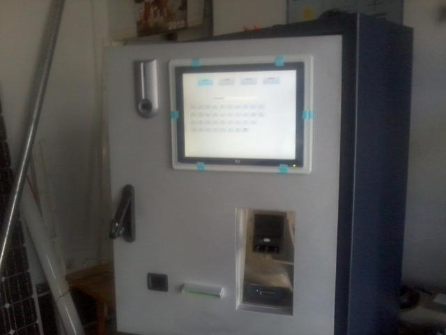

When the vehicle enters the parking lot, the OCR reads the vehicle licence plate number.
When leaving, the user enters the vehicle licence plate number using the touch screen at the kiosk.
Payment is possible with banknotes and cards. A fiscalized payment confirmation is issued.

